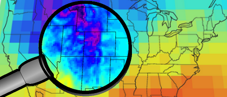

## Upcoming workshop

### **Working with downscaled climate projections in R**

**Who**: Dr Ralph Trancoso, Dr Sarah Chapman, Dr Rohan Eccles (DESI)

**When**: Wed May 21, 10a - 12p AEST

**Where**: Teams ([join our mailing list](https://docs.google.com/forms/d/e/1FAIpQLSeXfv6EPzm6ur5e9IrDPK07e5N1y2xxYNQlBe_xutTDu-ajBw/viewform) for the link)

**Description**:

In this workshop, we will cover the use of downscaled climate projections in R. This will include working with NetCDF files, plotting, and subsetting data to a target area. This session will also cover basic calculations, such as deriving bioclimatic indices and other relevant inputs which can be used for things like species distribution modelling.

**Requirements:**

R, RStudio, terra, dismo, dplyr, ggplot2

## Other Events

### Registration for the Winter R Workshops \@ UQ are NOW OPEN.

We are passionate users of R and want to share our experience. Our workshops are accessible, interactive, informative and fun. We provide all the code and learning materials. For more information on the topics covered and to view testimonials, see our [website](https://urldefense.com/v3/__https://asn.us3.list-manage.com/track/click?u=26c3400f39a2a193da8d06aae&id=5f0de409e7&e=cf6d478115__;!!NVzLfOphnbDXSw!BmZNccA8GsqWxhjne5fiv2bWEmIKwcIPcu3v41VPyqH6bp6KJGV_MJ8rfkMOxhvq3WAgrZD3WnC3-96wqQ$). For any questions about registration, email cbcs-workshops\@uq.edu.au.

Do you want to take your R skills to the next level, conquering the challenges of messy data, improving your ability to analyse data, and your capacity to do world-class, transparent, and repeatable research? Then the Centre for Biodiversity and Conservation Science (CBCS) Winter R Workshops \@ UQ are for you. These workshops delve into the world of data wrangling and visualisation, covering different topics than the Summer R workshops in February that focused on statistical modelling.

In our Winter R Workshops \@ UQ you will learn to transform raw data into actionable insights in an immersive journey into the art and science of data wrangling in R. These intensive, hands-on workshops are designed for individuals with a foundational understanding of R who are eager to master the essential skills for effective data wrangling, code organisation, visualisation, spatial analysis, and building interactive Shiny apps. Join us to elevate your R proficiency and become a data manipulation and presentation expert! Each day is self-contained so you can attend the workshops you want to.

-   Day 1 (Monday 14th July) Data Wrangling Part 1
-   Day 2 (Tuesday 15th July) Data Wrangling Part 2
-   Day 3 (Wednesday 16th July) Visual Storytelling
-   Day 4 (Thursday 17th July) Mapping our World
-   Day 5 (Friday 18th July) Building Interactive Web Apps with Shiny
