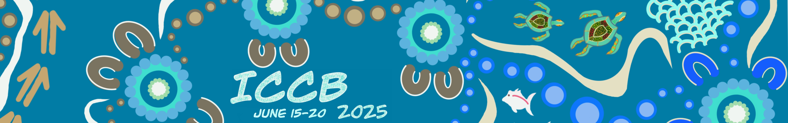

# Geospatial Share June Newsletter

## Next workshop -- ICCB June 14-15th

### International Congress for Conservation Biology (ICCB) Workshop

**Open Source Geospatial Tools for Conservation under Climate Change - a Koala Case Study**

Geospatial Share is going international with a pre-conference workshop for [ICCB](https://conbio.org/mini-sites/iccb-2025/) held in Meanjin/Brisbane on **June 14-15th, 2025**. The 2-day workshop is free for attendees of the conference - see registration details on the conference website.

::: {style="text-align: center;"}

:::

This workshop is designed to build practical skills in the use of open source geospatial tools to address real world conservation challenges. Using koala populations in south east Queensland as a case study, we have assembled a team of experts to cover:

-   **Getting started with geospatial tools in R** - [Jason Flower](https://emlab.ucsb.edu/about/our-team/jason-flower) (University of California, Santa Barbara), [Mitchel Rudge](https://www.linkedin.com/in/mitchel-rudge-phd-7a955025a/) (Bush Heritage Australia), [Catherine Kim](https://www.linkedin.com/in/seacatkim/) (QUT)

-   **Working with climate projection models** - [Ralph Trancoso](https://www.linkedin.com/in/ralph-trancoso-21546929/), [Sarah Chapman](https://www.linkedin.com/in/sarah-chapman-78338a6b/), [Rohan Eccles](https://www.linkedin.com/in/rohan-eccles-410737135/) (Queensland Future Climate Science Program)

-   **Modelling the future distribution of koalas** - [Scott Forrest](https://www.linkedin.com/in/swforrest/) and [Charlotte Patterson](https://www.linkedin.com/in/charlotterubyp/) (QUT)

-   **Putting it all together with conservation spatial planning** - [Caitie Kuempel](https://www.linkedin.com/in/caitie-kuempel-b86905110/) (Griffith University) and [Brooke Williams](https://www.linkedin.com/in/brooke-williams-141772114/) (The University of Newcastle)

-   **Integrating R with QGIS to create beautiful maps** - [Emma Hain](https://www.linkedin.com/in/emma-hain-9a47b12a/) (North Road and QGIS Australia), Nyall Dawson (North Road and QGIS Australia), Jason Flower.

## Previous workshop

Last month, Dr Ralph Trancoso, Dr Sarah Chapman, and Dr Rohan Eccles (DETSI) ran a practice session of the working with downscaled climate projections in R. It covered basic calculations, such as deriving bioclimatic indices and other relevant inputs which can be used for things like species distribution modelling. Many thanks to them for sharing their expertise.

We also aim to post the content on the [Geospatial Share website](https://brisbane-geocommunity.netlify.app/). See the [species distribution modelling](https://brisbane-geocommunity.netlify.app/posts/2025-04-16-species-distribution-modelling/) content from Charlotte Patterson & Scott Patterson online now.

## **National Science Week, 9-17 August**

National Science Week is Australia's annual celebration of science and technology. Running each year in August, it features more than 2000 events around Australia, and over three million people in science events across the nation. This year it will run from 9 to 17 August. Read more and get involved [here](https://urldefense.com/v3/__https://www.scienceweek.net.au/__;!!NVzLfOphnbDXSw!HFVtxjpN6gkxotMnN4ENpOugU-n44WIaNrqBYmUBC6MbFMUEN6pYLu3cCHUilwcNqDN3uovRXmgEQ5K3U0txJmO3ycTZ-pFlbzUwhvQ$ "https://urldefense.com/v3/__https://www.scienceweek.net.au/__;!!NVzLfOphnbDXSw!HFVtxjpN6gkxotMnN4ENpOugU-n44WIaNrqBYmUBC6MbFMUEN6pYLu3cCHUilwcNqDN3uovRXmgEQ5K3U0txJmO3ycTZ-pFlbzUwhvQ$").

### **11th ESP World Conference, Darwin, 23--27 June**

Charles Darwin University is hosting the 11th Ecosystem Services Partnership (ESP) World Conference in Darwin, covering transdisciplinary areas of ecology, economics and social sciences, and offering a platform for discussions on transforming our economies. The conference theme is \"From global to local ecosystem services: Pathways to nature-based solutions inspired from Down Under\". The conference will run from 23 to 27 June 2025. Check out the program and register [here](https://urldefense.com/v3/__https://www.espconference.org/esp11/homepage__;!!NVzLfOphnbDXSw!HFVtxjpN6gkxotMnN4ENpOugU-n44WIaNrqBYmUBC6MbFMUEN6pYLu3cCHUilwcNqDN3uovRXmgEQ5K3U0txJmO3ycTZ-pFlFa2WWbk$ "https://urldefense.com/v3/__https://www.espconference.org/esp11/homepage__;!!NVzLfOphnbDXSw!HFVtxjpN6gkxotMnN4ENpOugU-n44WIaNrqBYmUBC6MbFMUEN6pYLu3cCHUilwcNqDN3uovRXmgEQ5K3U0txJmO3ycTZ-pFlFa2WWbk$").

## PhD opportunities

**QUT**

Justine Shaw and Jonathan Rhodes have a PhD scholarship available to work with us on an exciting project exploring how to do better conservation planning in Antarctica's unique environment and conservation governance arrangements. The scholarship is available to domestic or international students and would suit someone interested in tackling interesting and useful applied conservation problems using quantitative tools. Details of the scholarship and how to apply can be found [here](https://www.qut.edu.au/study/fees-and-scholarships/scholarships/planning-to-conserve-biodiversity-in-the-planets-most-southern-extremities-phd-scholarship.). Contact Justine or Jonathan for more information.

**USC**

The University of the Sunshine Coast is offering a PhD with the team at Detection Dogs for Conservation (Sippy Downs campus) on a fully funded project on koalas -- conservation genetics, conservation management, landscape ecology and disease (chlamydia). The ideal candidate would have a strong interest in statistics and genetics, and enjoy conducting field work in urban/semi urban areas (not remote) in the Redlands Coast, SEQ. The successful candidate with go into the field  to lead weekly koala tracking and scat collection and assist (drone) or lead (dog) surveys using detection dogs and/or drones of a population with almost 10 years of long-term monitoring data. Applications close 11:55pm AEST on Friday 13 June 2025. More information, including how to apply, is [here](https://urldefense.com/v3/__https://unisc-cp.enquire.cloud/round/RND-0000049/894__;!!NVzLfOphnbDXSw!HFVtxjpN6gkxotMnN4ENpOugU-n44WIaNrqBYmUBC6MbFMUEN6pYLu3cCHUilwcNqDN3uovRXmgEQ5K3U0txJmO3ycTZ-pFlO5vfaAY$ "https://urldefense.com/v3/__https://unisc-cp.enquire.cloud/round/RND-0000049/894__;!!NVzLfOphnbDXSw!HFVtxjpN6gkxotMnN4ENpOugU-n44WIaNrqBYmUBC6MbFMUEN6pYLu3cCHUilwcNqDN3uovRXmgEQ5K3U0txJmO3ycTZ-pFlO5vfaAY$").

**JCU**

Bill and Susan Laurence are recruiting two MSc students and a postdoctoral researcher to work on a biological monitoring study in Papua New Guinea. The project will be fully funded (via CIFOR-ICRAF), with all salary and field costs covered for the students and postdoc. Suitably qualified PNG nationals are most welcome to apply, but any qualified applicant will be considered, regardless of nationality. This is an exciting and important project that involves camera-traps, eDNA, forest vegetation plots, acoustic monitoring and other methods to study wildlife and vegetation responses to human activities in an area spanning some 300,000 hectares. Interested people should contact Bill Laurence directly by email at [bill.laurance\@jcu.edu.au](mailto:bill.laurance@jcu.edu.au "mailto:bill.laurance@jcu.edu.au")

## Jobs

### **Research Assistant**

The [Threatened Species Index](https://urldefense.com/v3/__https://tsx.org.au/__;!!NVzLfOphnbDXSw!HFVtxjpN6gkxotMnN4ENpOugU-n44WIaNrqBYmUBC6MbFMUEN6pYLu3cCHUilwcNqDN3uovRXmgEQ5K3U0txJmO3ycTZ-pFlb3qxKJs$ "https://urldefense.com/v3/__https://tsx.org.au/__;!!NVzLfOphnbDXSw!HFVtxjpN6gkxotMnN4ENpOugU-n44WIaNrqBYmUBC6MbFMUEN6pYLu3cCHUilwcNqDN3uovRXmgEQ5K3U0txJmO3ycTZ-pFlb3qxKJs$") (TSX) team is seeking a casual Research Assistant to help with production of this year's TSX update, which will include the first Threatened Reptile Index. The position will suit someone with preferably an Honours or Masters level qualification, and strong data collection skills, solid grounding in R and good communication skills. This will be a two-to-three days per week role at this stage through to late November, with flexibility around which days are worked. Please express your interest asap by contacting Geoff Heard at [g.heard\@uq.edu.au](mailto:g.heard@uq.edu.au "mailto:g.heard@uq.edu.au") and Tayla Lawrie at [t.lawrie\@uq.edu.au](mailto:t.lawrie@uq.edu.au "mailto:t.lawrie@uq.edu.au").  

### Senior Geospatial Analyst

Edith Cowan University School of Medical and Health Sciences 1 year fixed year contract, full or part time PR or Australian Citizens only\
Full job [description](https://ecu.nga.net.au/cp/index.cfm?event=jobs.checkJobDetailsNewApplication&returnToEvent=jobs.listJobs&jobid=674FD332-A4CC-469F-9E05-B2E6012DC464&CurATC=EXT&CurBID=422C3E0D%2D4E21%2D4DD9%2DABB8%2D9DB40135CA83&JobListID=52d30031%2Dd147%2D1b48%2D1974%2D6d5424ffc295&jobsListKey=298a63f0%2Dd78e%2D4e7f%2D9930%2D945dcfc6b5c0&persistVariables=CurATC,CurBID,JobListID,jobsListKey,JobID&lid=52403100132&rmuh=4F53186A0E03240FA207A0F9B57A2E1753A521D4)

### Senior Consultant/Managing Consultant - GIS

ERM is looking for a **Senior Consultant/Managing Consultant - GIS** to be based in Australia. See more on [LinkedIn](https://www.linkedin.com/jobs/view/4223838830/?refId=J8UwxQS8HM9Bc7aTbxXdvw%3D%3D&trackingId=J8UwxQS8HM9Bc7aTbxXdvw%3D%3D).

### **Postdoctoral Researcher - Sweden**

The University of Jyväskylä, Finland is hiring fixed-term (two years) a Wisdom Fellow (Postdoctoral Researcher) or Senior Researcher in Biodiversity Footprint Assessment. The successful applicant will join the interdisciplinary Biodiversity Footprint Team at the School of Resource Wisdom. The background required may include a doctorate in business sciences, natural sciences, sustainability sciences or other applicable fields. You will have the opportunity to conduct applied research together with the Nordea bank, developing biodiversity footprint and handprint assessments for private and public organisations, procurements, financial investments as well as consumption and production in general. Applications close Thursday 5 June, with a start date of 1 September 2025 or as agreed. More information, including how to apply, is [here](https://urldefense.com/v3/__https://ats.talentadore.com/apply/wisdom-fellow-postdoctoral-researcher-or-senior-researcher-in-biodiversity-footprint-assessment/mWXNdJ__;!!NVzLfOphnbDXSw!HFVtxjpN6gkxotMnN4ENpOugU-n44WIaNrqBYmUBC6MbFMUEN6pYLu3cCHUilwcNqDN3uovRXmgEQ5K3U0txJmO3ycTZ-pFlWVVQdYA$ "https://urldefense.com/v3/__https://ats.talentadore.com/apply/wisdom-fellow-postdoctoral-researcher-or-senior-researcher-in-biodiversity-footprint-assessment/mWXNdJ__;!!NVzLfOphnbDXSw!HFVtxjpN6gkxotMnN4ENpOugU-n44WIaNrqBYmUBC6MbFMUEN6pYLu3cCHUilwcNqDN3uovRXmgEQ5K3U0txJmO3ycTZ-pFlWVVQdYA$").

### **Senior Spatial Analyst - DETSI**

The Queensland Department of Environment, Tourism, Science and Innovation has an opening in their Biodiversity Assessment team at Dutton Park (flexible) for a permanent full-time Senior Spatial Analyst. The role is responsible for the development, management and maintenance of a wide range of biodiversity-related spatial services and products. The ideal candidate will have strong GIS skills, and experience coding in Python would be a bonus. Applications close Wednesday 11 June 2025. More information, including how to apply, is [here](https://urldefense.com/v3/__https://smartjobs.qld.gov.au/jobtools/jncustomsearch.viewFullSingle?in_organid=14904&in_jnCounter=222999261__;!!NVzLfOphnbDXSw!HFVtxjpN6gkxotMnN4ENpOugU-n44WIaNrqBYmUBC6MbFMUEN6pYLu3cCHUilwcNqDN3uovRXmgEQ5K3U0txJmO3ycTZ-pFljpbA_kI$ "https://urldefense.com/v3/__https://smartjobs.qld.gov.au/jobtools/jncustomsearch.viewFullSingle?in_organid=14904&in_jnCounter=222999261__;!!NVzLfOphnbDXSw!HFVtxjpN6gkxotMnN4ENpOugU-n44WIaNrqBYmUBC6MbFMUEN6pYLu3cCHUilwcNqDN3uovRXmgEQ5K3U0txJmO3ycTZ-pFljpbA_kI$").

### **Senior Research Fellowship - Cambridge UK**

Christ's College, Cambridge in the UK is offering a new five-year Senior Research Fellowship in biodiversity to start from 1 October 2025. The position is one of two in the Darwin-Hamied Centre, which has a focus on both organismal ecology/evolution/conservation and demography, so priority will be given to applications that address the interface between these two broad areas. A parallel appointment is being made for a Fellowship in population, consumption or environmental aspects of demography, and their interface with biodiversity. This is an opportunity for the successful candidate to develop independent research in this area. Applications close Sunday 22 June 2025. More information, including how to apply, is [here](https://urldefense.com/v3/__https://www.christs.cam.ac.uk/vacancies-christs-college__;!!NVzLfOphnbDXSw!HFVtxjpN6gkxotMnN4ENpOugU-n44WIaNrqBYmUBC6MbFMUEN6pYLu3cCHUilwcNqDN3uovRXmgEQ5K3U0txJmO3ycTZ-pFlDA5Cm8s$ "https://urldefense.com/v3/__https://www.christs.cam.ac.uk/vacancies-christs-college__;!!NVzLfOphnbDXSw!HFVtxjpN6gkxotMnN4ENpOugU-n44WIaNrqBYmUBC6MbFMUEN6pYLu3cCHUilwcNqDN3uovRXmgEQ5K3U0txJmO3ycTZ-pFlDA5Cm8s$"), and please direct any questions to Andrew Balmford at [apb12\@cam.ac.uk](mailto:apb12@cam.ac.uk "mailto:apb12@cam.ac.uk")
